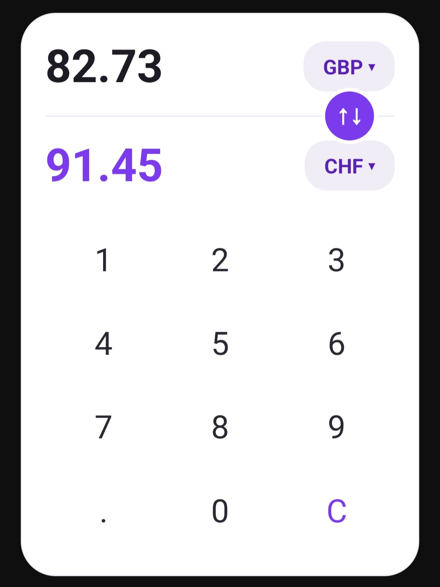
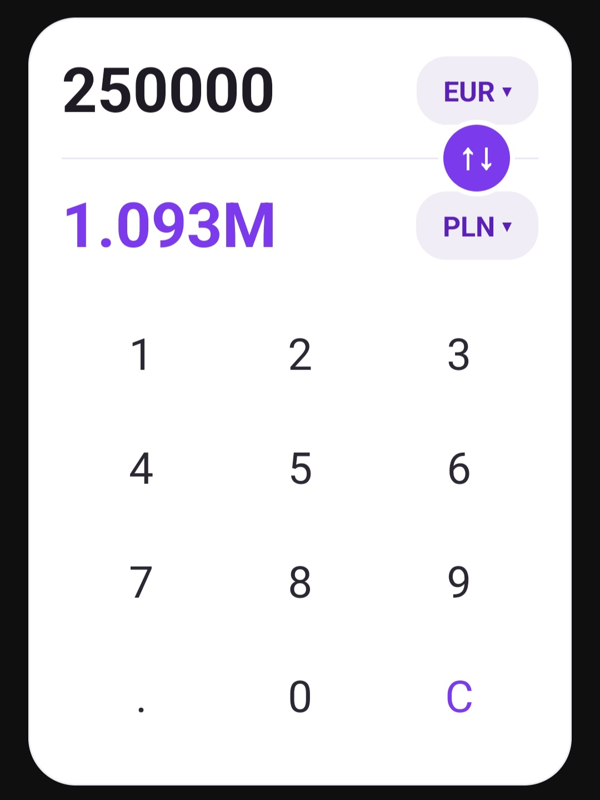

# Currency Converter Widget

A fast, native Android home screen widget for converting currencies. No app to open, no ads, no account, no tracking. Just a widget that sits on your home screen and does one thing well.





## Why

Most currency converter apps make you open the app, wait for it to load, and dig through a UI just to check a quick conversion. I was looking for a simple widget and all the ones from the Play Store did not cut it - slow, clunky, ugly, lacking features. This is just a simple, clean widget that does things how I wanted them to be done.

## Features

- Supports EUR, USD, GBP, CHF, PLN, and INR (easily extensible)
- Tap either currency to cycle through the list, independently
- One-tap swap between source and target
- Built-in keypad: digit entry, decimal point, clear all
- Always instant: renders from cache first, refreshes rates quietly in the background
- Exchange rates auto-refresh every 3 hours, only when the widget is actually in use
- Add as many instances as you want: each one remembers its own currencies and amount
- No ads, no tracking, no app - just the widget

## Install

### Download the APK
Grab the latest release from the [Releases page](https://github.com/LorenzoProSky/android-currency-converter-widget/releases/latest) and sideload it. You'll need to allow "install unknown apps" for whatever app you use to open the file, since this isn't distributed through the Play Store.

### Or build it yourself
```
git clone https://github.com/LorenzoProSky/android-currency-converter-widget.git
```
Open the project in Android Studio, let Gradle sync, and hit Run with a device connected. Requires Android 8.0 (API 26) or newer.

## How it's built

Native Kotlin, built directly on `AppWidgetProvider` and `RemoteViews`. Background refresh runs on `WorkManager`. Exchange rates come from the [Frankfurter API](https://www.frankfurter.app/) (daily ECB reference rates, no key required).

You or your agent can read more about it in the [documentation](resources/docs/documentation.md).

## License

MIT - see [LICENSE](LICENSE). Use it, fork it, change it, ship your own version.

## Credits

[App logo inspiration](https://www.typetogether.com/fonts/trevor)